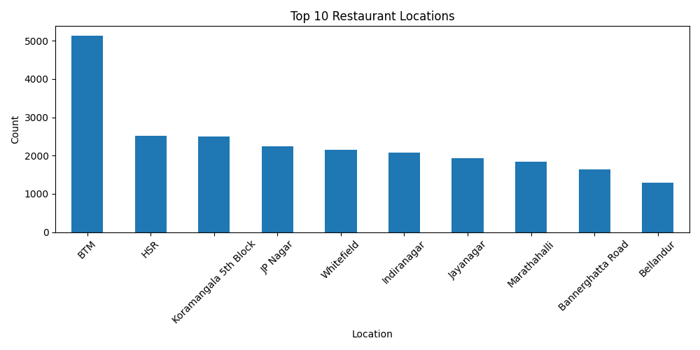
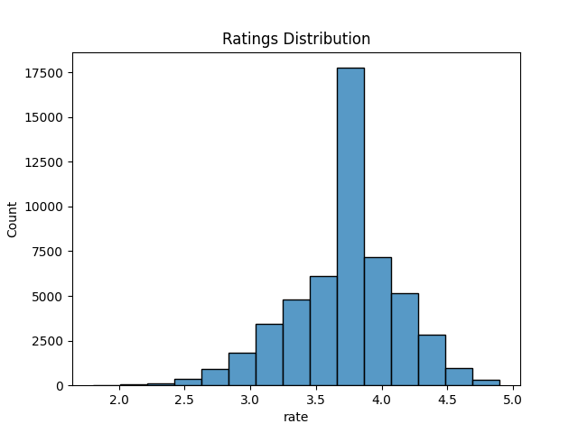
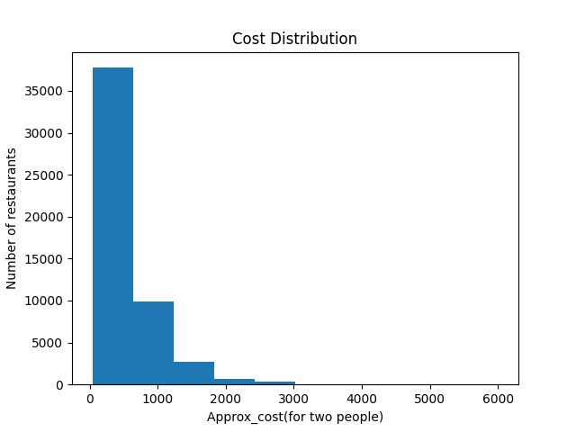
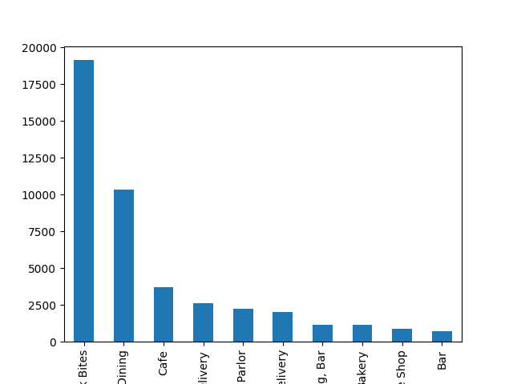

# 🍽️ Zomato Data Analysis Project

## 📌 Overview

This project analyzes Zomato restaurant data to extract insights about customer preferences, pricing trends, and restaurant distribution.

---

## 🎯 Objectives

* Analyze restaurant distribution by location
* Understand rating patterns
* Explore cost distribution
* Identify popular restaurant types

---

## 🛠️ Tech Stack

* Python
* Pandas
* NumPy
* Matplotlib
* Seaborn

---

## 📊 Key Insights

### 📍 Location Analysis

* BTM, HSR, and Koramangala are the top restaurant hubs
* Indicates high demand and strong competition

### ⭐ Ratings Analysis

* Most ratings lie between **3.5 – 4.5**
* Indicates generally positive customer satisfaction

### 💰 Cost Analysis

* Majority of restaurants are priced under ₹1000
* Market is dominated by affordable options

### 🍽️ Restaurant Types

* Quick Bites and Casual Dining are most common
* Reflects preference for convenience and affordability

---

## 📷 Visualizations

### Top Locations

### Ratings Distribution

### Cost Distribution

### Restaurant Types

---

## 🧠 Conclusion

The analysis shows that the restaurant market is highly competitive, with most businesses focusing on affordable pricing and maintaining good customer ratings.

---

## 🚀 Future Improvements

* Add NLP analysis on `dish_liked`
* Build ML model for rating prediction
* Deploy dashboard using Streamlit

---

## 👨‍💻 Author

Harsh Shah
